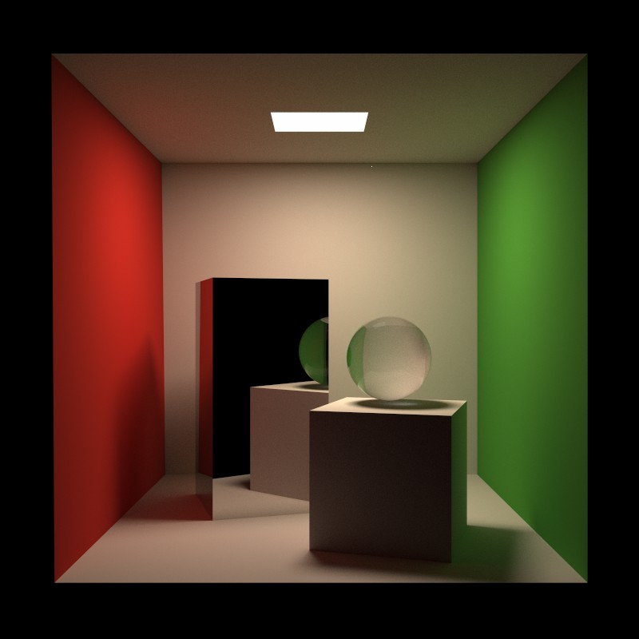
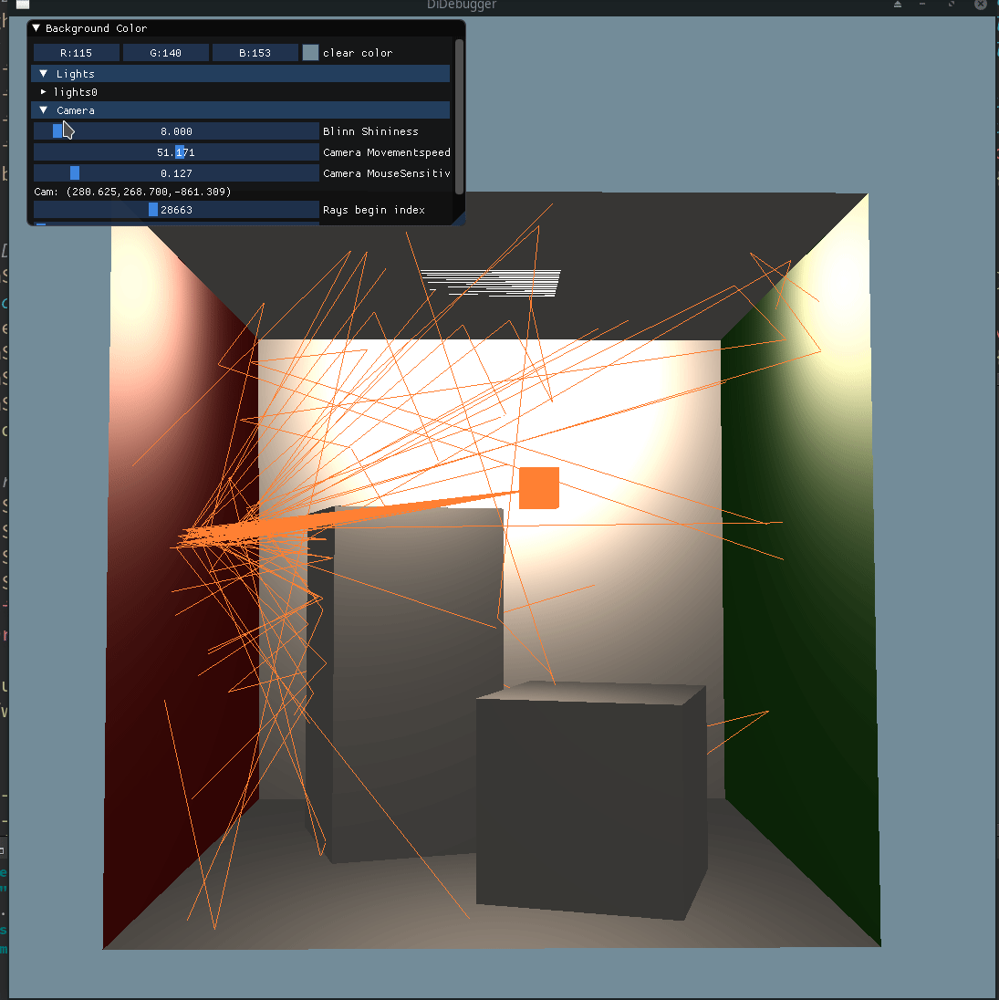
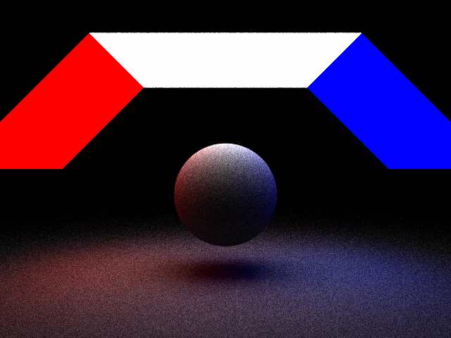

# DiRender

Not so tiny path tracer

- Linux gcc-7 /clang-7 / gcc-10 / clang-10

- Windows MSVC 2019

**Note**:
This program is being modified to meet the requirements
of [the CSE168 course by Prof Ravi Ramamoorthi](http://cseweb.ucsd.edu/~viscomp/classes/cse168/sp20/schedule.html).

## Milestone

- Cornel Box
  

- Debugger
  

- QuadLight(Not good enough, but not bad)
  

