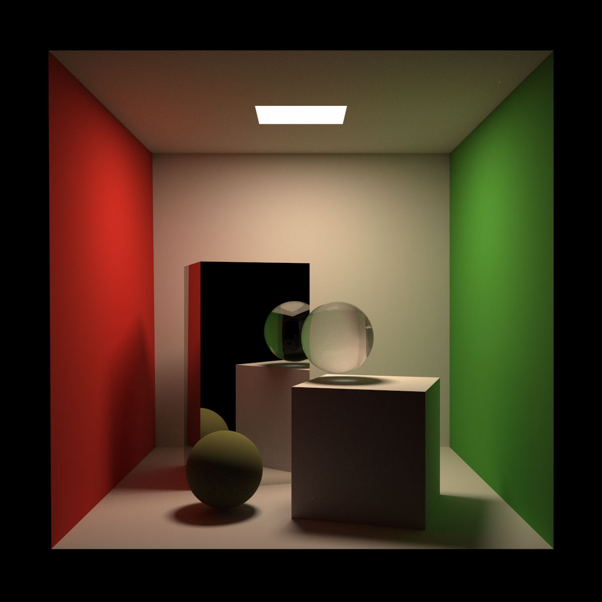
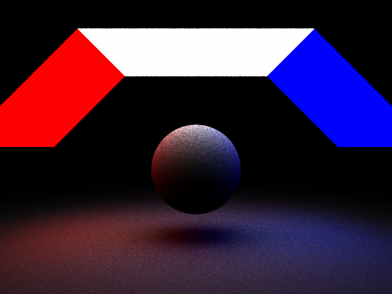

# DiRender

Not so tiny path tracer

- Linux gcc-7 /clang-7 / gcc-10 / clang-10

- Windows MSVC 2019

**Note**:
This program is being modified to meet the requirements
of [the CSE168 course by Prof Ravi Ramamoorthi](http://cseweb.ucsd.edu/~viscomp/classes/cse168/sp20/schedule.html).

# Features

:question: : partial, may not work, broken because of code evolution

:heavy_check_mark: : Complete

:x: : Not implemented but on the todolist

- :question: Debugger
- Integrator
    - :heavy_check_mark: Path tracing(Multiple Importance sampling, Russian Roulette and Shadow Ray)
    - :heavy_check_mark: Direct Lighting
    - :heavy_check_mark: Blinn-Phong Integrator(like that in OpenGL)
    - :x: Photon Mapping
- Material
    - :heavy_check_mark: CookTorrance(with GGX importance sampling)
    - :heavy_check_mark: Blinn-Phong(with importance sampling)
    - :heavy_check_mark: Glass
    - :heavy_check_mark: Dielectric
    - :heavy_check_mark: lambertian(with cosine weighted sampling)
- Accelerator
    - :heavy_check_mark: Naive BVH
    - :x: SAH BVH
    - :heavy_check_mark: linear list(just for testing)
- Sampler
    - :heavy_check_mark: Naive sampler(std::mt19937)
    - :heavy_check_mark: Halton sequence(no scramble)
    - :x: Sobel sequence
- Camera
    - :heavy_check_mark: Naive camera
    - :x: Motion blur
    - :x: Depth of field
- Shape
    - :heavy_check_mark: Triangle
    - :heavy_check_mark: Quad
    - :heavy_check_mark: Sphere
- Texture
    - :heavy_check_mark: Constant Texture
    - :heavy_check_mark: Checker Texture
    - :x: loading image texture(It is a little trivial. Some work has been done for it but there is still a lot to do)
- Parser
    - :heavy_check_mark: TOML parser(see cornel_box.toml)
    - :heavy_check_mark: Ravi parser(the format Prof Ravi defines in CSE168)
- Math
    - :heavy_check_mark: Vec3,Point3,Mat4
    - :heavy_check_mark: AABB
    - :heavy_check_mark: Transform

## Milestone

- Cornel Box (1200 x 1200 x 1024spp,about 35mins)

  Matte, dielectric, glass and Cook-Torrance material
  

- Debugger
  

- QuadLight(640 x 480, 128spp, cosine weight sampling)
  

- QuadLight(640 x 480, 128spp, Blinn-Phong importance sampling)
  This one looks much better.
  

- Ajax(768 x 768, normal integrator)
  Not difficult but amazing.
  
  

